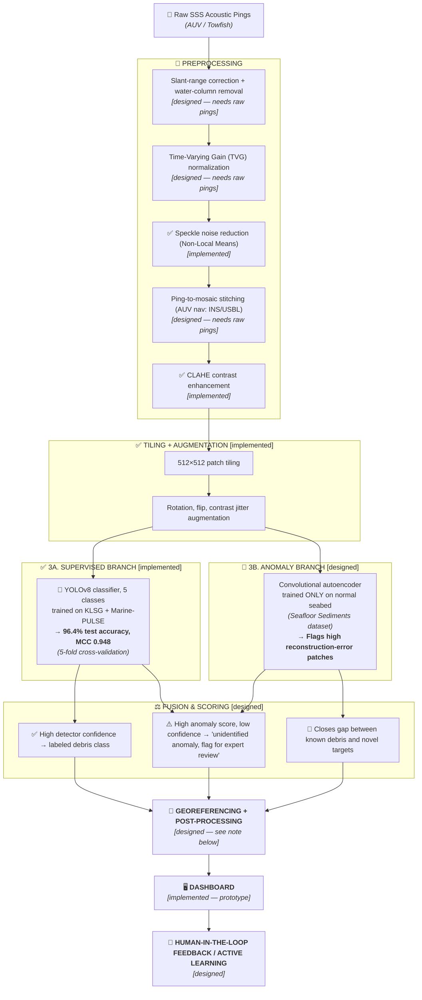

# 🌊 NilSagar
### AI-Powered Marine Debris & Anomaly Detection System — Side-Scan Sonar

**Smart India Hackathon 2026 · Problem Statement 26057**
Ministry of Earth Sciences (MoES) · National Institute of Ocean Technology (NIOT)

---

## 🎯 Overview

NilSagar reads side-scan sonar (SSS) imagery and flags man-made marine debris — with two branches working together: a **supervised classifier** 🎯 for debris types we have labeled examples of, and a **designed anomaly-detection branch** 🧠 for debris types no public dataset labels at all. This repo currently ships the supervised branch as a working, tested model; the anomaly branch and raw-sonar preprocessing stage are fully designed and documented below, pending real field data.

## 🧭 Why this approach

🇮🇳 India does not currently have a public, labeled side-scan sonar debris dataset. Every dataset used here (KLSG, Marine-PULSE, AI4Shipwrecks, Seafloor Sediments) was collected and pre-processed by international research groups — meaning the raw acoustic pings were already corrected, cropped, and published as clean images before we ever received them. Our pipeline is designed end-to-end for raw AUV data, but only the stages that operate on the pixel data we actually have were run in this build. That distinction is documented explicitly per stage below, not glossed over.

## 🔧 Pipeline

## 📊 Dataset

| Dataset | Used for | Images | Source |
|---|---|---|---|
| 🚢 SeabedObjects-KLSG | ship, airplane | 370 | [github.com/huoguanying/SeabedObjects-Ship-and-Airplane-dataset](https://github.com/huoguanying/SeabedObjects-Ship-and-Airplane-dataset) |
| 🔌 Marine-PULSE | pipeline/cable, engineering platform, seabed surface | 570 | [Zenodo, record 7922705](https://zenodo.org/records/7922705) |
| ⚓ AI4Shipwrecks | held out — generalization demo only, not trained on | 286 | Univ. of Michigan, [DOI 10.7302/dmf4-x492](https://doi.org/10.7302/dmf4-x492) |
| 🌊 Seafloor Sediments Dataset | planned for anomaly branch | 434,000+ (52GB) | Univ. of Girona, [Zenodo 10209445](https://zenodo.org/records/10209445) — deferred, too large for this build cycle |

**🧹 Cleaning applied before training:**
- ❌ Removed all "underwater residual mound" images from Marine-PULSE — a natural seabed formation, not debris, and including it would have taught the model to false-flag a harmless geological feature.
- ❌ Filtered out any drowning-victim / human-remains images as a safety precaution, regardless of whether the source dataset was expected to contain them.

**✅ Final class set (940 images, 5 classes):** ship (385), pipeline_or_cable (323), seabed_surface (88), engineering_platform (82), airplane (62).

## 📈 Results — 5-fold stratified cross-validation

| Fold | Train Acc | Test Acc | Test MCC |
|---|---|---|---|
| 0 | 1.000 | 0.963 | 0.946 |
| 1 | 0.989 | 0.931 | 0.901 |
| 2 | 0.999 | 0.973 | 0.962 |
| 3 | 0.999 | 0.963 | 0.947 |
| 4 | 0.995 | 0.989 | 0.985 |

**🤔 Why we report MCC, not just accuracy:** the class distribution above is imbalanced (385 ship images vs. 62 airplane images) — a model that mostly guesses the majority class can still post a deceptively high plain accuracy. MCC uses all four cells of the confusion matrix (true/false positives and negatives) and stays low if a model is secretly just exploiting class imbalance. Ours stayed high (0.948) across every fold, which is the actual evidence that the model is learning real class-distinguishing features, not just guessing "ship" most of the time.

## 🕸️ Why there is no ghost-net class

This is a known, field-wide gap, not something specific to us: real, labeled side-scan sonar images of ghost nets are extremely scarce, because nets are thin, low-acoustic-reflectivity, and easily confused with clutter or fishing-line noise even by expert annotators. The one existing public attempt we found (DRISHTI, built for this same problem statement) trains its ghost-net class entirely on **synthetic** data — nets that were never actually recorded by a real sonar. We chose not to adopt that approach: a classifier trained on synthetic acoustic signatures may not transfer reliably to how a real net actually reflects sound underwater, and shipping that as a "working" class risked giving false confidence in front of judges. Our anomaly branch is designed specifically to route around this gap — nets can be caught as an unlabeled anomaly instead of requiring a labeled class we do not have real data for. We are treating this as a placeholder pending an authoritative Indian-government-released ghost-net dataset, not a solved problem.

## 📍 Georeferencing and sonar range — why this stage isn't demoed yet

Georeferencing means converting a detection's pixel position in a sonar image into a real GPS coordinate — done by combining the exact time a ping was fired with the AUV's navigation log (from an inertial navigation system / USBL) at that same moment. This requires the raw survey's navigation data, which the public benchmark datasets used here do not include (they are pre-cropped labeled images with no accompanying nav log), so this stage is designed but not runnable on our current data.

📡 For context on the physical constraints this stage works within: side-scan sonar range and resolution trade off against each other based on the acoustic frequency used.

| Frequency | Range per side | Detail |
|---|---|---|
| ~100 kHz | ~300–600 m | Coarser — wide-area coverage |
| ~500 kHz | ~50–100 m | Fine — high debris detail |

A real deployment has to pick a frequency (or use a dual-frequency system) based on whether the priority is wide-area coverage or fine debris detail — this trade-off is a design constraint for any future AUV survey NilSagar is deployed on, not something the software layer controls.

## ♻️ A precaution worth documenting: biodegradable material vs. debris

Natural organic matter on the seabed — driftwood, dead fish, decaying kelp — can register as an "anomaly" to our anomaly branch just as readily as plastic or metal debris, since both simply deviate from the model's learned "normal seabed" texture. Flagging biodegradable material as debris isn't just a false positive — it risks sending real cleanup resources after something that would have broken down naturally, and eroding trust in the system's flags. The intended mitigation, not yet implemented, is a **persistence check**: re-surveying a flagged anomaly over repeat passes. Biodegradable material visibly degrades or disappears over weeks; plastic, metal, and rope do not. This is a planned filter, explicitly called out here rather than silently assumed away.

## 🖥️ Dashboard

A working prototype dashboard is included in this repo (`nilsagar.html`) — interactive map, class filters, confidence threshold slider, click-to-inspect detections.

## Setup & Testing Instructions

### Local Model Execution & Testing
Currently, model inference and full end-to-end testing are run locally across the backend and frontend components. 

- For complete, step-by-step instructions on how to set up and locally host the backend and frontend to see how the model works, please refer to the `README.md` file located inside the respective **`backend/`** directories (or branches).

### Frontend Dashboard Preview (`nilsagar.html`)
- `nilsagar.html` serves as a standalone UI design preview demonstrating how the final web dashboard will look visually.
- **Note:** The current backend/inference pipeline is not yet connected to this standalone HTML page. It is included for UI reference only.
- 
## 👥 Team

| | |
|---|---|
| 🧑‍💻 | Sneha Suklabaidya |
| 🧑‍💻 | Debojit Nath |
| 🧑‍💻 | Bidisha Goswami |
| 🧑‍💻 | Ved Bhandary |
| 🧑‍💻 | Roshan Upadhaya |
| 🧑‍💻 | Mahatma Doley |
